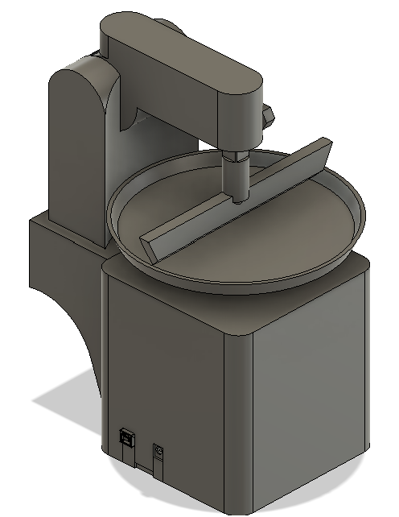

# Automatisierte Teigverteilungsmaschine – Motorsteuerung & Konstruktion

Dieses Projekt umfasst die Entwicklung einer Steuerung für einen rotierenden Teller, der Teig mithilfe einer Kelle gleichmäßig verteilt. Der Fokus liegt auf der präzisen Geschwindigkeitsregelung und der mechanischen Integration des Gesamtsystems.

  
   
  <em>Abbildung 1: 3D-Konstruktion der automatisierten Teigverteilungsmaschine.</em>

## Kernfunktionen
- **Variable Drehzahlsteuerung:** Präzise Regelung des Drehtellers via **PWM (Pulsweitenmodulation)** über einen L298N Motortreiber.
- **Benutzerschnittstelle:** Manuelle Geschwindigkeitsvorgabe über ein Potentiometer (eingelesen via **10-Bit ADC**).
- **Live-Feedback:** Anzeige der aktuellen Drehzahl (RPM-Schätzung) und des Duty Cycles auf einem LCD-Display zur Prozessüberwachung.
- **Gleichmäßige Verteilung:** Optimierte Rotationsgeschwindigkeit zur Unterstützung der mechanischen Teigverteilung.

## Hardware & Konstruktion
- **Mikrocontroller:** ATmega328P (Programmierung in Bare-Metal C).
- **Aktorik:** DC-Motor mit L298N H-Brücke.
- **Mechanik:** Eigenentwickeltes Gehäuse und Rahmen für den Drehteller.
- **Design-Tools:** CAD-Konstruktion der Gehäuseteile (siehe STL-Dateien im Ordner `/3d-models`).

## Software-Struktur
Der Code ist modular aufgebaut, um Hardware-Treiber und Hauptlogik sauber zu trennen:
- `main.c`: Steuerschleife, ADC-Auswertung und PWM-Generierung.
- `lcd.c / .h`: Treiber für die Visualisierung der Parameter.
- `i2c.c / .h`: Basis-Kommunikationsprotokoll für die Peripherie.

## Projektstruktur
- `/software`: Vollständiger C-Quellcode (Atmel Studio Projekt).
- `/3d-models`: STL-Dateien für das Gehäuse und mechanische Komponenten.
- `/media`: Projektbilder und Demonstrationsvideo der Funktion.
